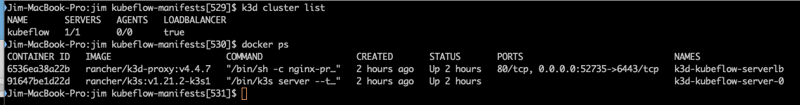
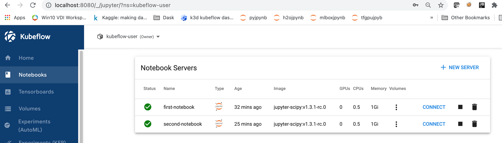
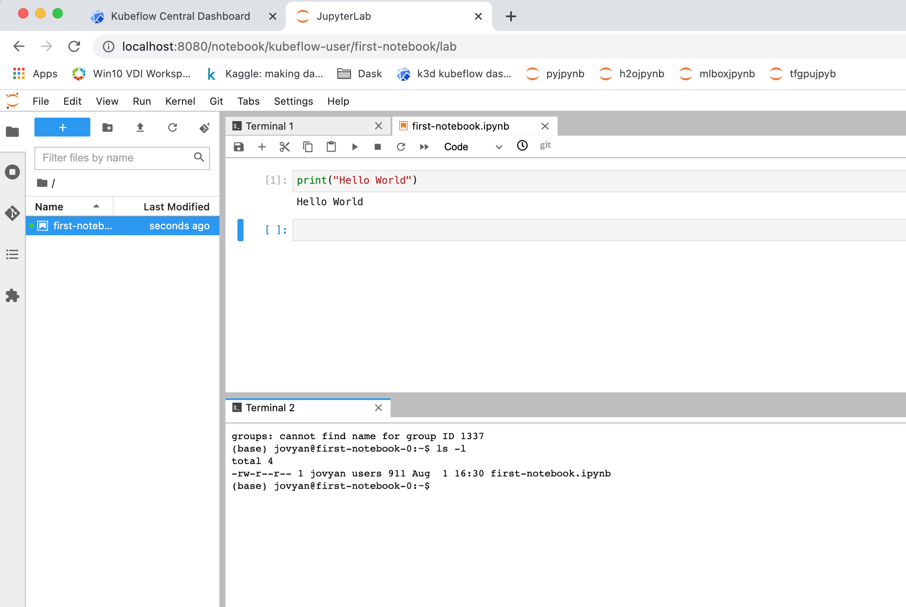
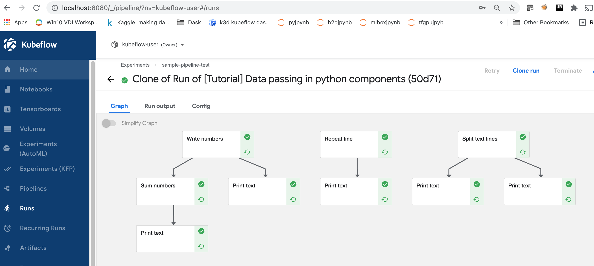
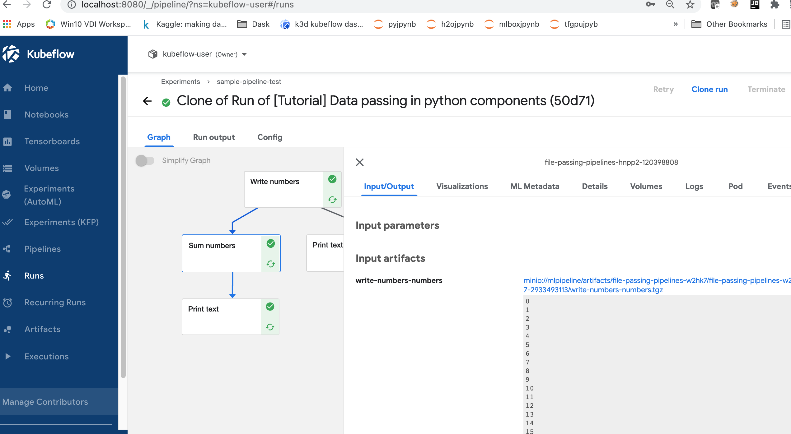
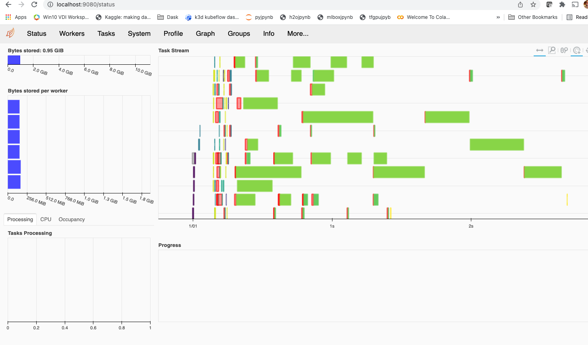
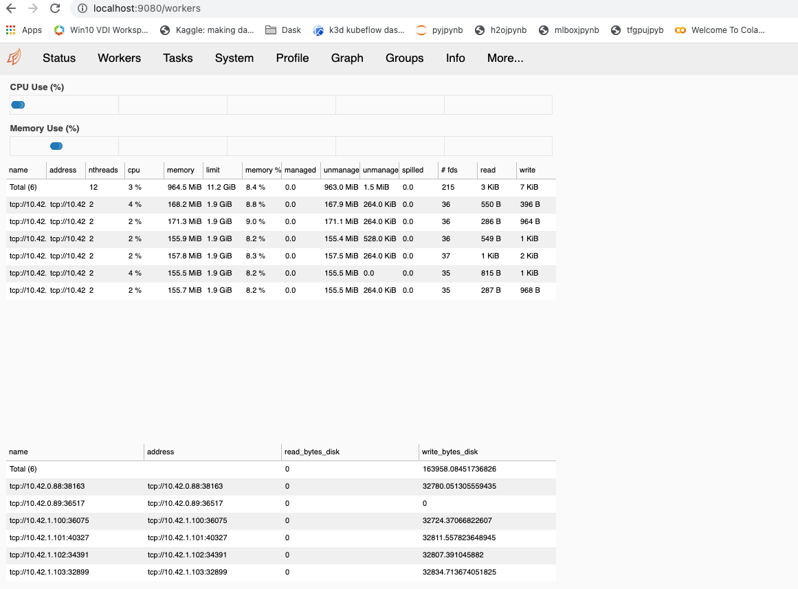

# Testing of k3d docker-based kubernetes cluster for kubeflow

## References
* https://k3d.io
* https://github.com/kubeflow/manifests


## Install instructions for k3d
```
curl -s https://raw.githubusercontent.com/rancher/k3d/main/install.sh | bash
```

## pre-reqs
* Docker for Mac
* `brew install`: `kubectl` and `kustomize`  and `istioctl` commands on Mac.

```
kustomize version
{Version:kustomize/v4.2.0 GitCommit:d53a2ad45d04b0264bcee9e19879437d851cb778 BuildDate:2021-07-01T00:44:28+01:00 GoOs:darwin GoArch:amd64}

kubectl version
Client Version: version.Info{Major:"1", Minor:"21", GitVersion:"v1.21.2", GitCommit:"092fbfbf53427de67cac1e9fa54aaa09a28371d7", GitTreeState:"clean", BuildDate:"2021-06-16T12:59:11Z", GoVersion:"go1.16.5", Compiler:"gc", Platform:"darwin/amd64"}
Server Version: version.Info{Major:"1", Minor:"21", GitVersion:"v1.21.2+k3s1", GitCommit:"5a67e8dc473f8945e8e181f6f0b0dbbc387f6fca", GitTreeState:"clean", BuildDate:"2021-06-21T20:52:44Z", GoVersion:"go1.16.4", Compiler:"gc", Platform:"linux/amd64"}

```


## create k3d cluster
Configuration file to create `kubeflow` cluster found in `k3d/kubeflow-cluster.yaml`.
```
# create local kubernetes cluster
k3d cluster create --config k3d/kubeflow-cluster.yaml
```

## manage k3d kubeflow Cluster
```
# stop running Cluster
k3d cluster stop kubeflow

# restart a stopped cluster, will take several minutes for all kubeflow services
# to start.
k3d cluster start kubeflow
```

## clone my fork of kubeflow/manifests repo to install kubeflow components
```
# clone kubeflow manifest repo

git clone https://github.com/jimthompson5802/manifests.git
```

Note: created branch `my_customization` for changes required for my setup. Here is
summary of changes.

```
Jim-MacBook-Pro:jim kubeflow-manifests[524]$ git status
On branch my_customizations
nothing to commit, working tree clean
git diff master | cat -
diff --git a/common/user-namespace/base/params.env b/common/user-namespace/base/params.env
index 9459383c..d1e3195b 100644
--- a/common/user-namespace/base/params.env
+++ b/common/user-namespace/base/params.env
@@ -1,2 +1,2 @@
 user=user@example.com
-profile-name=kubeflow-user-example-com
+profile-name=kubeflow-user
diff --git a/example/kustomization.yaml b/example/kustomization.yaml
index 6d6e23b4..2d20a18f 100644
--- a/example/kustomization.yaml
+++ b/example/kustomization.yaml
@@ -26,7 +26,7 @@ resources:


 # Kubeflow Pipelines
-- ../apps/pipeline/upstream/env/platform-agnostic-multi-user
+- ../apps/pipeline/upstream/env/platform-agnostic-multi-user-pns
 # KFServing
 - ../apps/kfserving/upstream/overlays/kubeflow
 # Katib
@@ -43,13 +43,14 @@ resources:
 - ../apps/profiles/upstream/overlays/kubeflow
 # Volumes Web App
 - ../apps/volumes-web-app/upstream/overlays/istio
-# Tensorboards Controller
+# Tensorboards Web App
 -  ../apps/tensorboard/tensorboard-controller/upstream/overlays/kubeflow
-# Tensorboard Web App
+# Tensorboard Controller
 -  ../apps/tensorboard/tensorboards-web-app/upstream/overlays/istio
 # Training Operator
 - ../apps/training-operator/upstream/overlays/kubeflow
 # MPI Operator
-- ../apps/mpi-job/upstream/overlays/kubeflow
+#- ../apps/mpi-job/upstream/overlays/kubeflow
+
 # User namespace
 - ../common/user-namespace/base

```

## deploy kubeflow components from the downloaded manifest profile

### install all at load
Note: commented out pytorch, mxnet, xgboost
Position on `my_customization` branch in root directory for the `kubeflow-manifests`
```
while ! kustomize build example | kubectl apply -f -; do echo "Retrying to apply resources"; sleep 10; done

```

To monitor install of kubeflow components, run following in another terminal window.
```
while true; do date; kubectl get pod -A | grep -v Running | wc; sleep 10; done

# When line count goes to 1, everything should be running.  Takes about 20 to 25 minutes on MBP 2019.
```


### install component by component
Run each  `kustomize`  command one at a time.  This takes 45+ minutes on a mid-2014
MBP with 16GB RAM.

```
# cd to kubeflow/manifest repo
# git checkout "my_customization" branch

# deploy each kubeflow service individually

# cert manager
kustomize build common/cert-manager/cert-manager/base | kubectl apply -f -
kustomize build common/cert-manager/kubeflow-issuer/base | kubectl apply -f -

# istio
kustomize build common/istio-1-9/istio-crds/base | kubectl apply -f -
kustomize build common/istio-1-9/istio-namespace/base | kubectl apply -f -
kustomize build common/istio-1-9/istio-install/base | kubectl apply -f -

# DEX
# fix for auhservice dex pod not starting https://github.com/dexidp/dex/issues/2082#issuecomment-818124478
# manually added specified environment variable to common/dex/base/deployment.yaml
kustomize build common/dex/overlays/istio | kubectl apply -f -


# OIDC Auth service
kustomize build common/oidc-authservice/base | kubectl apply -f -


# knative serving
# run knative-serving/base multiple times to define all resources
kustomize build common/knative/knative-serving/base | kubectl apply -f -
kustomize build common/istio-1-9/cluster-local-gateway/base | kubectl apply -f -

# optional for inference event logging (installed)
kustomize build common/knative/knative-eventing/base | kubectl apply -f -

# kubeflow namespace
kustomize build common/kubeflow-namespace/base | kubectl apply -f -


#kubeflow roles
kustomize build common/kubeflow-roles/base | kubectl apply -f -


#kubeflow istio resources
# this defines kubeflow-gateway
kustomize build common/istio-1-9/kubeflow-istio-resources/base | kubectl apply -f -

# kubeflow pipelines (multi-user) (had to re-run multiple times to ensure proper start up)
# this takes 20+ minutes
# May need to do `k3d cluster stop/start` to allow kubectl command to not hang
# pns exeuctor required for pipelines, docker executor not supported in k3d environment
kustomize build apps/pipeline/upstream/env/platform-agnostic-multi-user-pns | kubectl apply -f -


# KFServing
kustomize build apps/kfserving/upstream/overlays/kubeflow | kubectl apply -f -


# Katib
kustomize build apps/katib/upstream/installs/katib-with-kubeflow | kubectl apply -f -

# Central Dashboard
kustomize build apps/centraldashboard/upstream/overlays/istio | kubectl apply -f -


# Admission Webhook
kustomize build apps/admission-webhook/upstream/overlays/cert-manager | kubectl apply -f -

# Notebooks
kustomize build apps/jupyter/notebook-controller/upstream/overlays/kubeflow | kubectl apply -f -

# jupyter web app
kustomize build apps/jupyter/jupyter-web-app/upstream/overlays/istio | kubectl apply -f -


# Profiles + KFAM
kustomize build apps/profiles/upstream/overlays/kubeflow | kubectl apply -f -


# Volumes Web app
kustomize build apps/volumes-web-app/upstream/overlays/istio | kubectl apply -f -


# Tensorboard Web App and Controller
kustomize build apps/tensorboard/tensorboards-web-app/upstream/overlays/istio | kubectl apply -f -
kustomize build apps/tensorboard/tensorboard-controller/upstream/overlays/kubeflow | kubectl apply -f -


# Training Operators
kustomize build apps/training-operator/upstream/overlays/kubeflow | kubectl apply -f -


# kubeflow user namespace
# modified profile name from kubeflow-user-example-com to kubeflow-user
kustomize build common/user-namespace/base | kubectl apply -f -


# check if all components are running, all pods should be in 'Running' state
echo -e "\ncert-manager"; kubectl get pods -n cert-manager
echo -e "\nistio-system"; kubectl get pods -n istio-system
echo -e "\nauth"; kubectl get pods -n auth
echo -e "\nknative-eventing"; kubectl get pods -n knative-eventing
echo -e "\nknative-serving"; kubectl get pods -n knative-serving
echo -e "\nkubeflow"; kubectl get pods -n kubeflow
echo -e "\nkubeflow-user"; kubectl get pods -n kubeflow-user

```

## Port forward
After establishing port forwarding, access kubeflow dashboard
`http://localhost:8080`.  Good enough for local development work for an individual,
not suitable for any other uses.  The default email address is `user@example.com` and the default password is `12341234`.
```
# port forward to kubeflow dashboard
kubectl port-forward svc/istio-ingressgateway -n istio-system 8080:80 &

# port foward for manually started dask scheduler ui
kubectl port-forward svc/dask-scheduler-ui -n kubeflow-user  9080:80 &

```

## Screenshot of using kubeflow in k3d cluster
### k3d cluster Running


### Notebook server




### Kubeflow pipelines




### DASK Scheduler UI



## Useful commands
### Remove completed kubeflow pipeline pods
```
# Use this to see what pods will be deleted
kubectl get pod  -l workflows.argoproj.io/completed=true --field-selector=status.phase==Succeeded

# to remove the pods
kubectl delete pod  -l workflows.argoproj.io/completed=true --field-selector=status.phase==Succeeded

```

## URL for dockerhub registry
```
registry.hub.docker.com/<organization>/<image_repository>:<tag>
```


## Setp HTTPS (Note for future work)
Reference: setup up https for kubeflow:https://www.civo.com/learn/get-up-and-running-with-kubeflow-on-civo-kubernetes

```
cat <<EOF
apiVersion: cert-manager.io/v1alpha2
kind: Certificate
metadata:
  name: istio-ingressgateway-certs
  namespace: istio-system
spec:
  commonName: istio-ingressgateway.istio-system.svc
  # Use ipAddresses if your LoadBalancer issues an IP
  ipAddresses:
  - <LoadBalancer IP>
#  # Use dnsNames if your LoadBalancer issues a hostname (eg DNS name from Civo dashboard)
#  dnsNames:
#  - <LoadBalancer HostName>
  isCA: true
  issuerRef:
    kind: ClusterIssuer
    name: kubeflow-self-signing-issuer
  secretName: istio-ingressgateway-certs

```
